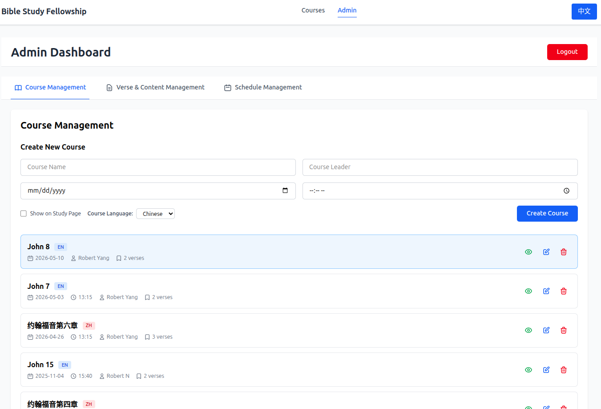
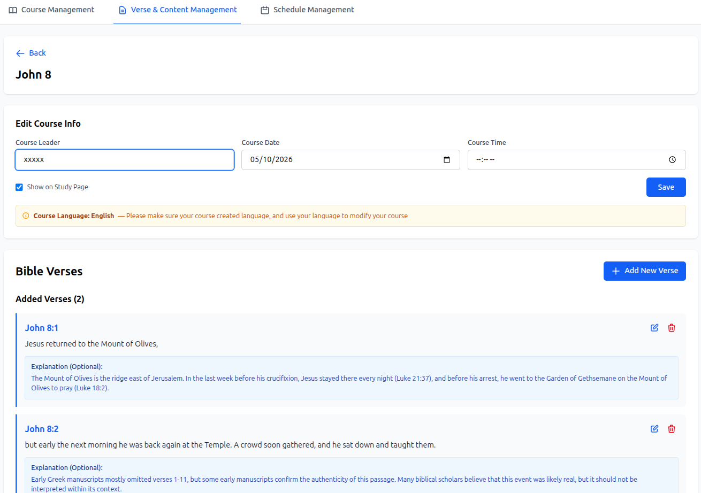
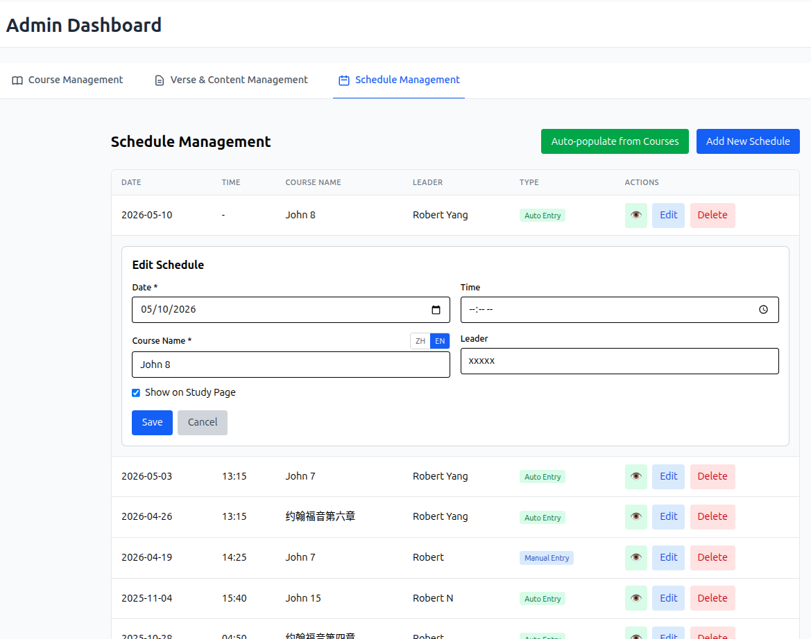
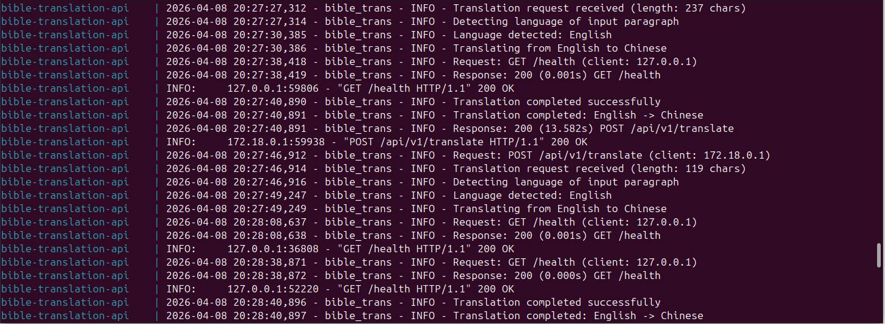

# Bible Study Group Teaching Document Management

A full-stack web application for managing and displaying Bible study course materials with bilingual support (Chinese/English). Designed for local deployment with 10–20 users.

## Work Introduction
This project is done by using Claude Code.
To see the demo website go to: https://bible-study-app.ych2tj.workers.dev/
Course edit and translation are protected by authentications. If someone want to try,Please contact me. 

## Claude Code Tips

This project was built using [Claude Code](https://claude.ai/code).

- At the start of a new feature, use plan mode — ask Claude to draft a plan first and review it before proceeding
- If a bug persists after two fix attempts, share the relevant file or code segment directly and ask Claude to double-check its assumptions
- Telling more detail about your operation can help debug.
- Use the `browser-tools` MCP for in-browser debugging (console errors, network logs, screenshots)
- Run `/init` after each major iteration to keep `CLAUDE.md` up to date with the current architecture

---

## Main Features

- **Bilingual Support** — Full Chinese/English interface with a language toggle; all course content (verses, study notes, references) is stored in both languages
- **Study Page** — Public-facing page for browsing courses, reading Bible verses with explanations, and viewing the upcoming schedule
- **Edit Page** — Password-protected admin dashboard for creating and managing courses, verses, study notes, and schedules
- **AI-Assisted Translation** — Translate course content between Chinese and English using a connected translation API; side-by-side review and one-click save
This is corresponding to bible translation API, [API source](https://github.com/ych2tj/bible-translation-api)
- **Schedule Management** — Auto-populate the schedule from courses, or add manual entries; bidirectional sync between schedule and course data
- **PC & Mobile View Modes** — Study page adapts to device: PC mode shows explanations in a resizable card; mobile mode uses inline accordion

---

## Study Page

The Study Page is publicly accessible — no login required.

### Courses Tab

- Displays all visible courses in a grid layout
- Each course card shows the course name, verse count, date, time, and leader
- Click a course to open its full content view
- Language toggle switches all UI text and bilingual course content between Chinese and English

**Course Content View:**
- Bible verses are displayed as a continuous paragraph with superscript verse numbers
- Verses are sorted by chapter and verse number
- **PC Mode**: Click a verse to see its explanation in a separate card below; the card height is resizable by dragging
- **Mobile Mode**: Click a verse to expand an inline accordion-style explanation
- View mode preference is saved to the browser (localStorage)
- Study notes and references are shown at the bottom; reference URLs are converted to clickable links

### Schedule Tab

- Displays upcoming course sessions (past dates are automatically hidden)
- Shows date, time, course name, and leader
- Only visible schedule entries are shown, sorted by date

---

## Edit Page (Admin Dashboard)

The Edit Page requires password authentication. It provides three management tabs.

### Course Management Tab

- Create new courses with: name (required), leader, date, time, visibility, and language (Chinese or English)
- View all courses including hidden ones; each course shows a ZH/EN language badge and verse count
- Edit course info inline; toggle visibility with the eye icon
- Delete courses (cascades to verses, study content; linked schedule entries become manual)
- Click a course to open it directly in the Verse & Content tab

**Screenshot:**




### Verse & Content Management Tab

- Select a course to manage its verses and study content
- **Bible Verses**: Add, edit, and delete verses; each verse has a gospel, chapter, verse number, content, and optional explanation
- Amber language warning banners remind you to enter content in the course's original language
- **Study Notes**: Edit freeform study notes for the course
- **References**: Enter references in `URL - Title` format (one per line); URLs become clickable links on the Study Page
- **Translation Button**: Opens the AI-assisted Translation Page for the selected course

**Screenshots:**

| Verse & Content Editor |
|---|
|  |


### Schedule Management Tab

- **Auto-Populate**: Generate schedule entries from all courses that have a date set; updates existing entries and maintains sync
- **Manual Entry**: Add standalone schedule items independent of any course
- Edit schedule entries inline; auto-populated entries sync changes back to the linked course
- Toggle schedule entry visibility; delete entries with confirmation
- Bilingual course name entry (ZH/EN tabs) for schedule items

**Screenshot:**



---

## AI-Assisted Translation

The Translation Page (`/translation/:courseId`) provides a side-by-side view of original and translated content for a course.

- Displays course name, all Bible verses (content + explanation), and study notes in a table
- Translate individual items with a per-row button, or batch-translate all items at once
- Rate-limited to ~6 seconds between API calls to respect translation service limits (10 req/min)
- Translated text is saved directly to the database via the backend (API key is never exposed to the browser)
- After saving, return to the Edit Page — the course auto-selects and returns to the Verse tab

**Translation API logs (example):**
Interested in the API, please go to [here](https://github.com/ych2tj/bible-translation-api) to see the source code.



---

## Technology Stack

| Layer | Technologies |
|---|---|
| Frontend | React 18 + TypeScript, Vite, Tailwind CSS v4, React Router, React i18next |
| Backend | Node.js + Express, SQLite (better-sqlite3), RESTful API |
| Translation | Proxied via backend to an external translation API |

---

## Getting Started

### Prerequisites

- Node.js v18 or higher
- npm

### Configuration

Create a `.env` file manually in the project root (this file is git-ignored):

```
AUTH_USERNAME=your_username
AUTH_PASSWORD=your_password
```

For the AI translation feature, also add:

```
BIBLE_TRANSLATION_API_URL=https://your-translation-service.com
BIBLE_TRANSLATION_API_KEY=your-key
```

### Installation

```bash
# Backend
cd backend && npm install

# Frontend
cd ../frontend && npm install
```

### Running the Application

Both servers must run simultaneously:

```bash
# Terminal 1 — Backend (port 3001)
cd backend && npm run dev

# Terminal 2 — Frontend (port 5173)
cd frontend && npm run dev
```

- **Study Page (public)**: `http://localhost:5173/`
- **Edit Page (admin)**: `http://localhost:5173/edit`

Alternatively, use the convenience script to start both servers at once:

```bash
./start.sh
```


### Local Network Access

To share the app with other users on your local network:

1. Find your local IP: `ip addr show` (Linux) or `ifconfig` (Mac)
2. Update `API_BASE_URL` in `frontend/src/services/api.ts` to use your IP instead of `localhost`
3. Share `http://192.168.x.x:5173` with users

---

## Troubleshooting

| Problem | Fix |
|---|---|
| Blank page on load | `rm -rf frontend/node_modules/.vite`, then hard refresh |
| Port already in use | `pkill -f "node --watch" && pkill -f "vite"` |
| CORS errors | Ensure backend runs on port 3001; check `API_BASE_URL` in `services/api.ts` |
| Database errors | Delete `backend/database.sqlite` and restart backend to reset |

---

